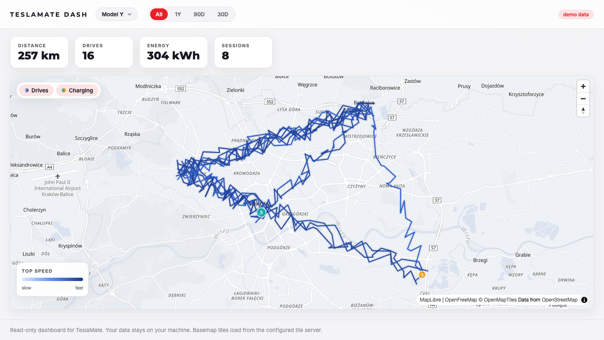

# TeslaMate Dash

[](https://github.com/gmaslowski/teslamate-dash/actions/workflows/ci.yml)
[](https://github.com/gmaslowski/teslamate-dash/actions/workflows/docker.yml)
[](LICENSE)
[](https://buymeacoffee.com/gmaslowski)

A small, self-hosted, **read-only dashboard for [TeslaMate](https://github.com/teslamate-org/teslamate)**.
It connects to your existing TeslaMate Postgres database and renders a clean, map-first view of your
driving and charging history. One static Go binary, one container, no second database, and nothing is
ever written back to TeslaMate.



> The screenshot above runs in demo mode with synthetic data. Your real data never leaves your machine.

## Features

- **Map-first.** Every drive is drawn from its GPS trace and **colored by speed** (a perceptual
  light-to-deep blue ramp), so you can read where you go fast and where you crawl at a glance.
- **Charging on the same map.** Sessions are **clustered by location within 50 m** into a single
  marker that shows the session count, total energy, and AC/DC split. Click any cluster for details.
- **Per-car.** Multi-car aware. Pick a vehicle by its TeslaMate name (or view all cars combined);
  the whole dashboard filters to it.
- **Any timeframe.** All time, last year, 90 days, or 30 days, with a loading indicator while data
  refreshes.
- **Headline stats.** Distance, drives, energy, and charging sessions for the current selection.
- **Layer toggles.** Show drives, charging, or both (both by default).
- **3D buildings & globe.** Buildings extrude as you zoom and tilt into a city; the world renders on a
  globe projection.
- **Light, fast UI.** MapLibre + vanilla JS, no build step, served straight from the binary.

## Quick start (demo, no database)

```bash
docker build -t teslamate-dash .
docker run --rm -p 4001:4001 teslamate-dash
# open http://localhost:4001  (DEMO mode with synthetic data)
```

Or with Go (1.22+):

```bash
go run .          # demo mode when no DATABASE_HOST/TC_DSN is set
```

### Published image

Multi-arch images (linux/amd64 and linux/arm64) are published to GHCR on every release:

```bash
docker run --rm -p 4001:4001 ghcr.io/gmaslowski/teslamate-dash:latest
# or pin a version: ghcr.io/gmaslowski/teslamate-dash:0.1.0
```

Tags: `latest` (tip of `main`), `X.Y.Z` / `X.Y` / `X` (semver from git tags), and `sha-<commit>`.

## Connect to your TeslaMate database

Run it on the same Docker network as TeslaMate so it can reach Postgres. It reuses TeslaMate's
`DATABASE_*` variables, so usually you only set the password.

```bash
docker run --rm -p 4001:4001 \
  --network teslamate_default \
  -e DATABASE_HOST=database \
  -e DATABASE_USER=teslamate_ro \
  -e DATABASE_PASS=secret \
  -e DATABASE_NAME=teslamate \
  teslamate-dash
```

Or add it to your existing TeslaMate `docker-compose.yml` as another service:

```yaml
  dash:
    build: ./teslamate-dash   # or image: ghcr.io/youruser/teslamate-dash
    environment:
      - DATABASE_HOST=database
      - DATABASE_USER=teslamate_ro
      - DATABASE_PASS=${TM_DB_PASS}
      - DATABASE_NAME=teslamate
      - TC_UNITS=km
    ports:
      - 4001:4001
    restart: unless-stopped
```

### Use a read-only database role (recommended)

The app forces read-only sessions, but a dedicated read-only role is the right belt-and-braces move:

```sql
CREATE ROLE teslamate_ro WITH LOGIN PASSWORD 'secret';
GRANT CONNECT ON DATABASE teslamate TO teslamate_ro;
GRANT USAGE ON SCHEMA public TO teslamate_ro;
GRANT SELECT ON ALL TABLES IN SCHEMA public TO teslamate_ro;
ALTER DEFAULT PRIVILEGES IN SCHEMA public GRANT SELECT ON TABLES TO teslamate_ro;
```

### Deploy with Helm (Kubernetes)

A minimal self-contained chart. Create a `teslamate-dash/` directory with these four files:

`teslamate-dash/Chart.yaml`

```yaml
apiVersion: v2
name: teslamate-dash
description: Read-only dashboard for TeslaMate
type: application
version: 0.1.0
appVersion: "0.1.0"
```

`teslamate-dash/values.yaml`

```yaml
image:
  repository: ghcr.io/gmaslowski/teslamate-dash
  tag: "0.1.0"
service:
  port: 4001
# Non-secret settings (reuses TeslaMate's DATABASE_* names).
env:
  DATABASE_HOST: teslamate-db
  DATABASE_NAME: teslamate
  DATABASE_USER: teslamate_ro
  TC_UNITS: km
# DB password is read from an existing Secret (create it separately, see below).
dbPasswordSecret:
  name: teslamate-dash-db
  key: password
```

`teslamate-dash/templates/deployment.yaml`

```yaml
apiVersion: apps/v1
kind: Deployment
metadata:
  name: {{ .Release.Name }}
spec:
  replicas: 1
  selector:
    matchLabels: { app: {{ .Release.Name }} }
  template:
    metadata:
      labels: { app: {{ .Release.Name }} }
    spec:
      containers:
        - name: teslamate-dash
          image: "{{ .Values.image.repository }}:{{ .Values.image.tag }}"
          ports:
            - containerPort: 4001
          env:
            {{- range $k, $v := .Values.env }}
            - name: {{ $k }}
              value: {{ $v | quote }}
            {{- end }}
            - name: DATABASE_PASS
              valueFrom:
                secretKeyRef:
                  name: {{ .Values.dbPasswordSecret.name }}
                  key: {{ .Values.dbPasswordSecret.key }}
          readinessProbe:
            httpGet: { path: /, port: 4001 }
          securityContext:
            runAsNonRoot: true
            allowPrivilegeEscalation: false
            readOnlyRootFilesystem: true
            capabilities: { drop: ["ALL"] }
```

`teslamate-dash/templates/service.yaml`

```yaml
apiVersion: v1
kind: Service
metadata:
  name: {{ .Release.Name }}
spec:
  selector: { app: {{ .Release.Name }} }
  ports:
    - port: {{ .Values.service.port }}
      targetPort: 4001
```

Create the DB password Secret, then install (use the read-only role from above):

```bash
kubectl create secret generic teslamate-dash-db --from-literal=password='secret'
helm install teslamate-dash ./teslamate-dash
# reach it: kubectl port-forward svc/teslamate-dash 4001:4001
```

Add an Ingress (or set `service.type: LoadBalancer`) to expose it beyond the cluster. For SSL to the
database, set `TC_DSN` under `env` instead of the `DATABASE_*` parts.

### Not using Docker?

Any reachable Postgres works. For a database that lives elsewhere (a remote host, a Kubernetes
cluster, etc.), expose it to the dashboard however you normally would (for example a port-forward to
`localhost:5432`) and point the variables below at it. Use `TC_DSN` if you need SSL.

## Configuration

All configuration is via environment variables. `TC_`-prefixed names override the plain TeslaMate ones.

| Variable | Default | Purpose |
|---|---|---|
| `DATABASE_HOST` / `TC_DATABASE_HOST` | (none) | TeslaMate Postgres host. Empty means demo mode. |
| `DATABASE_PORT` / `TC_DATABASE_PORT` | `5432` | Postgres port |
| `DATABASE_NAME` / `TC_DATABASE_NAME` | `teslamate` | Database name |
| `DATABASE_USER` / `TC_DATABASE_USER` | `teslamate` | DB user (use a read-only role) |
| `DATABASE_PASS` / `TC_DATABASE_PASS` | (none) | DB password |
| `TC_DSN` | (none) | Full `postgres://...` connection string, overrides the parts above (set `sslmode` here) |
| `TC_PORT` | `4001` | HTTP port |
| `TC_UNITS` | `km` | `km` or `mi` |
| `TC_TITLE` | `TeslaMate Dash` | Header title |
| `TC_MAP_STYLE_URL` | OpenFreeMap Positron | MapLibre style URL. Point at your own tiles for full privacy. |
| `TC_DOWNSAMPLE` | `4` | Keep every Nth GPS point when drawing routes (higher is lighter) |
| `TC_REDACT_HOME` | `true` | Reserved flag for hiding the home area in shareable views. Parsed and exposed on `/api/config`, but not yet enforced, so it currently has no visible effect. |
| `TC_DEMO` | auto | Force synthetic data on or off |

## Privacy

This data is your home address, geofences, and full movement history. The app is built to keep it yours:

- **Read-only.** Sessions are forced read-only and it never writes to TeslaMate.
- **No telemetry, no analytics, no outbound calls from the server.**
- **Local rendering.** The one external request a browser makes is for **basemap tiles** from
  `TC_MAP_STYLE_URL`. Point that at a self-hosted tile server if you do not want a third party to see
  which areas you pan to.
- Coordinates are never logged. Keep your fork private if you commit any of your own data.

## How it works

A single Go binary embeds the web UI and talks to Postgres over a read-only `pgx` pool. The frontend is
MapLibre GL plus a little vanilla JS, with no build step.

| File | Role |
|---|---|
| `main.go` | HTTP server, graceful shutdown, embeds `web/` |
| `config.go` | Environment configuration |
| `model.go` | Types and the `Store` interface |
| `db.go` | Read-only pgx pool and all SQL (the only file that touches Postgres) |
| `demo.go` | Synthetic data so it runs with no database |
| `handlers.go` | JSON API |
| `web/` | Embedded MapLibre + vanilla JS frontend |

## Development

```bash
go mod tidy
go run .                 # demo mode if no DATABASE_HOST
# point at a database:
DATABASE_HOST=localhost DATABASE_PASS=secret go run .
```

Tested against the TeslaMate schema tables `drives`, `positions`, `charging_processes`, `charges`,
`addresses`, `geofences`, `cars`. The app checks these exist on startup and fails with a clear message
if your TeslaMate version differs.

## Support

If this is useful to you, you can support the work here:

<a href="https://buymeacoffee.com/gmaslowski" target="_blank">
  
</a>

[buymeacoffee.com/gmaslowski](https://buymeacoffee.com/gmaslowski)

## Disclaimer

Not affiliated with, endorsed by, or sponsored by Tesla, Inc. or TeslaMate. "Tesla" is a trademark of
Tesla, Inc. This project only reads data you already collect with TeslaMate.

## License

MIT. See [`LICENSE`](LICENSE).
