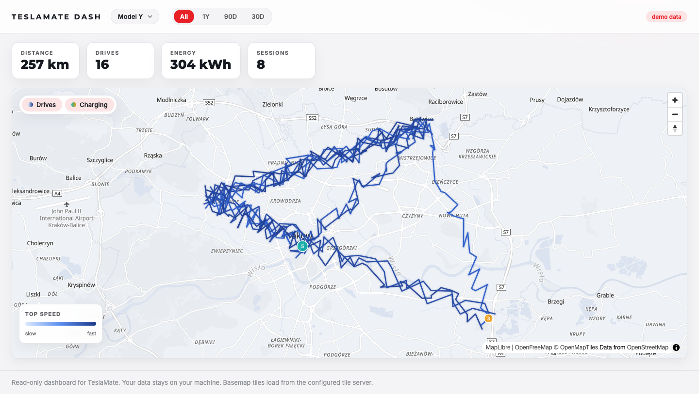

# TeslaMate Dash

[](https://github.com/gmaslowski/teslamate-dash/actions/workflows/ci.yml)
[](https://github.com/gmaslowski/teslamate-dash/actions/workflows/docker.yml)
[](LICENSE)
[](https://buymeacoffee.com/gmaslowski)

A small, self-hosted, **read-only dashboard for [TeslaMate](https://github.com/teslamate-org/teslamate)**.
It connects to your existing TeslaMate Postgres database and renders a clean, map-first view of your
driving and charging history. One static Go binary, one container, no second database, and nothing is
ever written back to TeslaMate.

**▶ [Try the live demo](https://demo.teslamate.maslowski.cloud)** — no install, running in demo mode with synthetic data.


> The recording above (and the live demo) run in demo mode with synthetic data. Your real data never leaves your machine.

<details>
<summary>Static screenshot</summary>



</details>

## Features

- **Map-first.** Every drive is drawn from its GPS trace and **colored by speed** (a light-to-deep
  blue ramp with a white casing), so you can read where you go fast and where you crawl at a glance.
- **Presentation mode.** Tick any drives and charges in the activity feed to **isolate them on the
  map** — build the exact route you want to walk someone through, then Focus map to frame it.
  Shift-click range-selects; **Share** serializes the selection into a URL you can send around.
- **Detail panels.** Click any drive — in the feed, or its route on the map — for a stat grid,
  state-of-charge bar, and a **speed + battery chart** over the trip. Click a charge (or its marker)
  for the real **charging curve** (power vs. state of charge) with peak/avg/min power and range
  added. Step through activities with ‹ › without leaving the panel.
- **Trip summary.** Turn a selection into a route-planner-style itinerary: departure → drive legs →
  charge stops (with SoC bars and energy) → arrival, plus drive/charge time totals.
- **Activity feed.** Drives and charging sessions merged newest-first, with type filters
  (All / Drives / Charging) and an eye toggle that hides home & destination charging from both the
  list and the map.
- **Charge classification.** Supercharger stops (DC fast charging), home charging (inside a named
  geofence), and destination charging are told apart from the data, not hardcoded, and get distinct
  markers.
- **KPI cards.** Distance, drives, energy, and efficiency for the range — each with a delta against
  the prior period of equal length and a sparkline of the trend.
- **Any timeframe.** All time, last year, 90 days, 30 days, or a custom From/To range with quick
  presets.
- **Per-car.** Multi-car aware; pick a vehicle in the header and the whole dashboard filters to it.


## Quick start (demo, no database)

```bash
docker build -f docker/Dockerfile -t teslamate-dash .
docker run --rm -p 4001:4001 teslamate-dash
# open http://localhost:4001  (DEMO mode with synthetic data)
```

Or with Go (1.22+) and Node (20+):

```bash
(cd src/web && npm install && npm run build)   # build the embedded UI first
go run ./src      # demo mode when no DATABASE_HOST/TC_DSN is set
```

### Published image

Multi-arch images (linux/amd64 and linux/arm64) are published to GHCR on every release:

```bash
docker run --rm -p 4001:4001 ghcr.io/gmaslowski/teslamate-dash:latest
# or pin a version: ghcr.io/gmaslowski/teslamate-dash:0.1.0
```

Tags: `latest` (tip of `main`), `X.Y.Z` / `X.Y` / `X` (semver from git tags), and `sha-<commit>`.

## Connect to your TeslaMate database

Run it on the same Docker network as TeslaMate so it can reach Postgres. It reuses TeslaMate's
`DATABASE_*` variables, so usually you only set the password.

```bash
docker run --rm -p 4001:4001 \
  --network teslamate_default \
  -e DATABASE_HOST=database \
  -e DATABASE_USER=teslamate_ro \
  -e DATABASE_PASS=secret \
  -e DATABASE_NAME=teslamate \
  teslamate-dash
```

Or add it to your existing TeslaMate `docker-compose.yml` as another service:

```yaml
  dash:
    build:                    # or image: ghcr.io/youruser/teslamate-dash
      context: ./teslamate-dash
      dockerfile: docker/Dockerfile
    environment:
      - DATABASE_HOST=database
      - DATABASE_USER=teslamate_ro
      - DATABASE_PASS=${TM_DB_PASS}
      - DATABASE_NAME=teslamate
      - TC_UNITS=km
    ports:
      - 4001:4001
    restart: unless-stopped
```

### Use a read-only database role (recommended)

The app forces read-only sessions, but a dedicated read-only role is the right belt-and-braces move:

```sql
CREATE ROLE teslamate_ro WITH LOGIN PASSWORD 'secret';
GRANT CONNECT ON DATABASE teslamate TO teslamate_ro;
GRANT USAGE ON SCHEMA public TO teslamate_ro;
GRANT SELECT ON ALL TABLES IN SCHEMA public TO teslamate_ro;
ALTER DEFAULT PRIVILEGES IN SCHEMA public GRANT SELECT ON TABLES TO teslamate_ro;
```

### Deploy with Helm (Kubernetes)

A minimal self-contained chart. Create a `teslamate-dash/` directory with these four files:

`teslamate-dash/Chart.yaml`

```yaml
apiVersion: v2
name: teslamate-dash
description: Read-only dashboard for TeslaMate
type: application
version: 0.1.0
appVersion: "0.1.0"
```

`teslamate-dash/values.yaml`

```yaml
image:
  repository: ghcr.io/gmaslowski/teslamate-dash
  tag: "0.1.0"
service:
  port: 4001
# Non-secret settings (reuses TeslaMate's DATABASE_* names).
env:
  DATABASE_HOST: teslamate-db
  DATABASE_NAME: teslamate
  DATABASE_USER: teslamate_ro
  TC_UNITS: km
# DB password is read from an existing Secret (create it separately, see below).
dbPasswordSecret:
  name: teslamate-dash-db
  key: password
```

`teslamate-dash/templates/deployment.yaml`

```yaml
apiVersion: apps/v1
kind: Deployment
metadata:
  name: {{ .Release.Name }}
spec:
  replicas: 1
  selector:
    matchLabels: { app: {{ .Release.Name }} }
  template:
    metadata:
      labels: { app: {{ .Release.Name }} }
    spec:
      containers:
        - name: teslamate-dash
          image: "{{ .Values.image.repository }}:{{ .Values.image.tag }}"
          ports:
            - containerPort: 4001
          env:
            {{- range $k, $v := .Values.env }}
            - name: {{ $k }}
              value: {{ $v | quote }}
            {{- end }}
            - name: DATABASE_PASS
              valueFrom:
                secretKeyRef:
                  name: {{ .Values.dbPasswordSecret.name }}
                  key: {{ .Values.dbPasswordSecret.key }}
          readinessProbe:
            httpGet: { path: /, port: 4001 }
          securityContext:
            runAsNonRoot: true
            allowPrivilegeEscalation: false
            readOnlyRootFilesystem: true
            capabilities: { drop: ["ALL"] }
```

`teslamate-dash/templates/service.yaml`

```yaml
apiVersion: v1
kind: Service
metadata:
  name: {{ .Release.Name }}
spec:
  selector: { app: {{ .Release.Name }} }
  ports:
    - port: {{ .Values.service.port }}
      targetPort: 4001
```

Create the DB password Secret, then install (use the read-only role from above):

```bash
kubectl create secret generic teslamate-dash-db --from-literal=password='secret'
helm install teslamate-dash ./teslamate-dash
# reach it: kubectl port-forward svc/teslamate-dash 4001:4001
```

Add an Ingress (or set `service.type: LoadBalancer`) to expose it beyond the cluster. For SSL to the
database, set `TC_DSN` under `env` instead of the `DATABASE_*` parts.

### Not using Docker?

Any reachable Postgres works. For a database that lives elsewhere (a remote host, a Kubernetes
cluster, etc.), expose it to the dashboard however you normally would (for example a port-forward to
`localhost:5432`) and point the variables below at it. Use `TC_DSN` if you need SSL.

## Configuration

All configuration is via environment variables. `TC_`-prefixed names override the plain TeslaMate ones.

| Variable | Default | Purpose |
|---|---|---|
| `DATABASE_HOST` / `TC_DATABASE_HOST` | (none) | TeslaMate Postgres host. Empty means demo mode. |
| `DATABASE_PORT` / `TC_DATABASE_PORT` | `5432` | Postgres port |
| `DATABASE_NAME` / `TC_DATABASE_NAME` | `teslamate` | Database name |
| `DATABASE_USER` / `TC_DATABASE_USER` | `teslamate` | DB user (use a read-only role) |
| `DATABASE_PASS` / `TC_DATABASE_PASS` | (none) | DB password |
| `TC_DSN` | (none) | Full `postgres://...` connection string, overrides the parts above (set `sslmode` here) |
| `TC_PORT` | `4001` | HTTP port |
| `TC_UNITS` | `km` | `km` or `mi` |
| `TC_TITLE` | `TeslaMate Dash` | Header title |
| `TC_MAP_STYLE_URL` | OpenFreeMap Positron | MapLibre style URL. Point at your own tiles for full privacy. |
| `TC_DEMO` | auto | Force synthetic data on or off |

### Languages

The web UI supports English, German, French, Spanish, Italian, Dutch, Norwegian, Swedish, Danish,
Finnish, Polish, Portuguese, Simplified Chinese, Japanese, Korean, and Russian. The first visit uses
the browser language; the globe button next to the theme button changes it and remembers the choice.
Each translation is kept in its own JSON file under `src/web/src/locales/`. English is the fallback, so an
untranslated key is shown in English instead of as a missing label. A small built-in helper handles
language detection, plural forms, and persistence; changing the language reloads the page.

## Privacy

This data is your home address, geofences, and full movement history. The app is built to keep it yours:

- **Read-only.** Sessions are forced read-only and it never writes to TeslaMate.
- **No telemetry, no analytics, no outbound calls from the server.**
- **Local rendering.** The one external request a browser makes is for **basemap tiles** from
  `TC_MAP_STYLE_URL`. Point that at a self-hosted tile server if you do not want a third party to see
  which areas you pan to.
- Coordinates are never logged. Keep your fork private if you commit any of your own data.

## How it works

A single Go binary embeds the built web UI and talks to Postgres over a read-only `pgx` pool. The
frontend is React + TypeScript (Vite) with MapLibre GL; position traces are simplified server-side
(Douglas-Peucker) so map payloads stay small even for six-hour drives.

| File | Role |
|---|---|
| `src/main.go` | HTTP server, graceful shutdown, embeds `src/web/dist` |
| `src/config.go` | Environment configuration |
| `src/model.go` | Types, the `Store` interface, trace simplification |
| `src/db.go` | Read-only pgx pool and all SQL (the only file that touches Postgres) |
| `src/demo.go` | Synthetic data so it runs with no database |
| `src/handlers.go` | JSON API (`/api/config`, `/api/cars`, `/api/summary`, `/api/activities`, `/api/activities/{id}`) |
| `src/web/` | React + Vite + TypeScript frontend, built to `src/web/dist` |
| `docker/` | Dockerfile and its dockerignore |

## Development

```bash
(cd src/web && npm install && npm run build)   # required once before go build/run
go mod tidy
go run ./src             # demo mode if no DATABASE_HOST
# point at a database:
DATABASE_HOST=localhost DATABASE_PASS=secret go run ./src
```

For frontend work, run the API and the Vite dev server side by side; Vite proxies `/api` to `:4001`:

```bash
go run ./src                 # terminal 1
cd src/web && npm run dev    # terminal 2, open the printed URL
```

The Docker image always builds with the **repo root as context** (`docker build -f docker/Dockerfile .`);
the frontend is built inside the image, so no local `npm` run is needed for container builds. BuildKit
(the default builder since Docker 23) automatically applies `docker/Dockerfile.dockerignore`.

Tested against the TeslaMate schema tables `drives`, `positions`, `charging_processes`, `charges`,
`addresses`, `geofences`, `cars`. The app checks these exist on startup and fails with a clear message
if your TeslaMate version differs.

## Support

If this is useful to you, you can support the work here:

<a href="https://buymeacoffee.com/gmaslowski" target="_blank">
  
</a>

[buymeacoffee.com/gmaslowski](https://buymeacoffee.com/gmaslowski)

## Disclaimer

This project is an unofficial community tool and is not affiliated with, endorsed by, or supported by
the official TeslaMate project.

Not affiliated with, endorsed by, or sponsored by Tesla, Inc. either. "Tesla" is a trademark of
Tesla, Inc. This project only reads data you already collect with TeslaMate.

## License

Copyright (c) 2026 Greg Maslowski.

Licensed under the GNU Affero General Public License v3.0 (AGPL-3.0). See [`LICENSE`](LICENSE).
